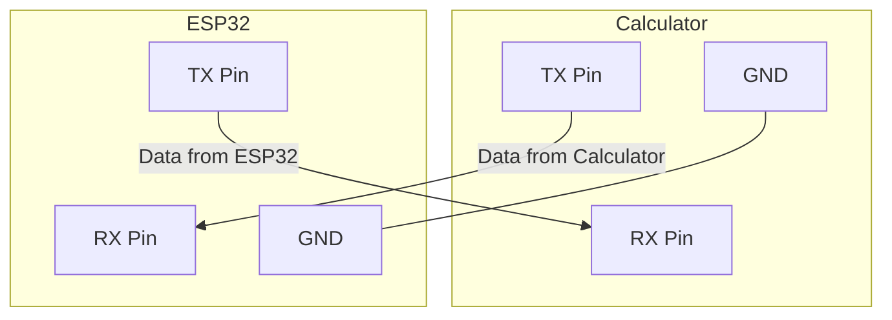
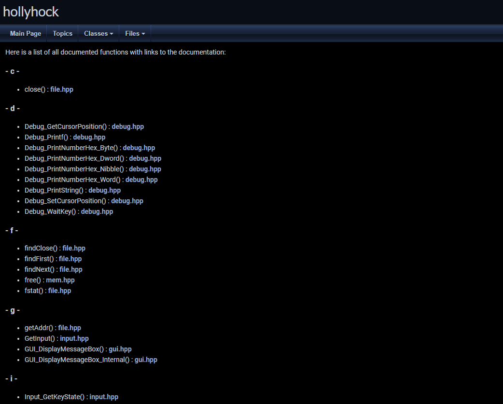

# Journel
> High level goalL Connect Casio ClassPad fx-CP400 calculator to Gemini Ai API, i want to be able to type a question into the the calc, send it to gemini then have the answer displayed in the calc.

## 30/5/2025
> Research stuff

### Specs of fx-CP400 (Classpad II) 
Useful resource: [Calc specs and more](https://classpaddev.github.io/)

| General          | CPU                            | Memory                      | Connector                                         | Battery                                                                 |
| :--------------- | :----------------------------- | :-------------------------- | :------------------------------------------------ | :---------------------------------------------------------------------- |
| Weight: 315 grams | SuperH 4 (SH7305) processor | Total Memory: 64 MB<br>User Memory: 512 KB | USB Mini-B / 3pin cable<br>(up to 115.2 kilobits/s) | Power: 4 AAA alkaline or<br>nickel-metal hydride batteries<br>Power Consumption: 1.0 W - 100 hours in use |

### Serial Communication 
  * TX (Transmit): this pin sends data out of calc 
  * RX (Receive): this pin receives data in to the calc
  * GND: Common electrical reference point (0 Volts) 
    - When connected to the ESP32, TX pin connects to the calcs RX pin and vice versa, and obv grounds need to connect

## 6/5/2025
> More research, i guess understanding serial in greater depth? I have no clue on anything whooops
Ok, so with hollyhock we can send and receive serial data via [serial](https://github.com/SnailMath/hollyhock-2/blob/master/sdk/include/sdk/os/serial.hpp)

# REMEMBER 


#### *WTH IS Baudrate?*
* The baudrate for the calc is 115,200, meaning it can send 115,200 bits per second. **Meaning roughly 11,520 chars per second; each character is 8bits**

#### What voltage is *refresher* 😭
* analogously electrical pressure

### Core serial functions in hollyhock
Luckily in our luck, hollyhock has done our dirty work - the low level stuff, which is perfect; dont know what id do otherwise haha
* [serial.hpp](hollyhock-2/sdk/include/sdk/os/serial.hpp) Look at [Notes](notes/SpoonFedBasicSerialControl.md) for ai slop documentation; still useful tho


### More serial info of calc
So the ESP32 operates on 3.3V, and confirmed by @that.snail, the fx-CP400 alson operates on 3.3V!!
this is great that means they are directly compatible, and there is no need for a logic level shifter, which is more complexity i dont need!

$GND_{ESP32} = GND_{Classpad}$

### Started material list. For tmwr and on, 
* [Materials](Notes/Materials.md)

Impulsively bought.. oh wellll

## 6/6/2025
The bulk fo today was setting up the development enviroment.
I spent time looking over [hollyhock repo](https://github.com/SnailMath/hollyhock-2), as i have made a couple really basic apps in the past, so this was a refresher but, also i wanted to gain a deeper intuition in the the different functions, structure etc. As this is pretty low level stuff compared to the things i make and having a genuine understanding of HOW things work together or singularly i think will help. 

As also i have a rocky and limited understanding of C++/C, most of it comes from how a lot of languages inherit C++/C's lexicon such as for loops, definition of variables etc. I want to learn how to use it and understand my code, not vibe code it - that takes the fun out of it. However i will most definitely use ai, to explain foreign concepts!

Luckily in my case, ive already went through the pain of making the sh4-elf-g++ compiler within my WSL terminal. 

### Auto Documentation! - Doxygen 
I learnt about this tool called **Doxygen** in short it creates comprehensive documentation for code bases such as this - when you dont really know the structure and or structure of things and functions. 
* [Doxygen](https://www.doxygen.nl/index.html)





### General Testing
Just getting a feel for making little apps - not for function just for practice

```cpp
// ...
void main() {
    calcInit(); 
    fillScreen(color(0, 0, 0));
    float a = 10.5f;
    float b = 5.2f;
    float sum = a + b;
    float difference = a - b;
    float product = a * b;
    float quotient = a / b;

    Debug_Printf(0, 0, false, 0, "Sum: %f", sum);
    Debug_Printf(0, 10, false, 0, "Difference: %f", difference);
    Debug_Printf(0, 20, false, 0, "Product: %f", product);
    Debug_Printf(0, 30, false, 0, "Quotient: %f", quotient);

    LCD_Refresh();
    
    while (true) {
        uint32_t key1, key2;
        getKey(&key1, &key2);
        if (testKey(key1, key2, KEY_CLEAR)) {
            break;
        }
    }
    
    calcEnd();
}
```