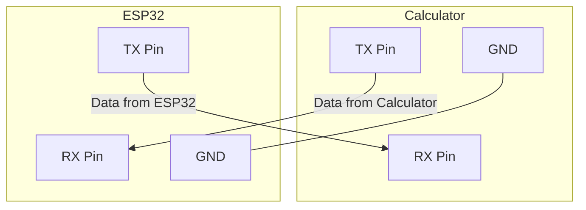

# Journel

## 30/5/2025
> Research stuff

### Specs of fx-CP400 (Classpad II) 
Useful resource: [Calc specs and more](https://classpaddev.github.io/)

| General          | CPU                            | Memory                      | Connector                                         | Battery                                                                 |
| :--------------- | :----------------------------- | :-------------------------- | :------------------------------------------------ | :---------------------------------------------------------------------- |
| Weight: 315 grams | SuperH 4 (SH7305) processor | Total Memory: 64 MB User Memory: 512 KB | USB Mini-B / 3pin cable (up to 115.2 kilobits/s) | Power: 4 AAA alkaline or nickel-metal hydride batteries Power Consumption: 1.0 W - 100 hours in use |

### Serial Communication 
  * TX (Transmit): this pin sends data out of calc 
  * RX (Receive): this pin receives data in to the calc
  * GND: Common electrical reference point (0 Volts) 
    - When connected to the ESP32, TX pin connects to the calcs RX pin and vice versa, and obv grounds need to connect

## 6/5/2025
> More research, i guess understanding serial in greater depth? I have no clue on anything whooops
Ok, so with hollyhock we can send and receive serial data via [serial](https://github.com/SnailMath/hollyhock-2/blob/master/sdk/include/sdk/os/serial.hpp)

# REMEMBER 

#### *WTH IS Baudrate?*
* The baudrate for the calc is 115,200, meaning it can send 115,200 bits per second. **Meaning roughly 11,520 chars per second; each character is 8bits**

#### What voltage is *refresher* 😭
* analogously electrical pressure

### Core serial functions in hollyhock
Luckily in our luck, hollyhock has done our dirty work - the low level stuff, which is perfect; dont know what id do otherwise haha
* [serial.hpp](hollyhock-2/sdk/include/sdk/os/serial.hpp) Look at [Notes](notes/SpoonFedBasicSerialControl.md) for ai slop documentation; still useful tho

### More serial info of calc
So the ESP32 operates on 3.3V, and confirmed by @that.snail, the fx-CP400 alson operates on 3.3V!!
this is great that means they are directly compatible, and there is no need for a logic level shifter, which is more complexity i dont need!

$GND_{ESP32} = GND_{Classpad}$

### Started material list. For tmwr and on, 
* [Materials](Notes/Materials.md)

Impulsively bought.. oh wellll

