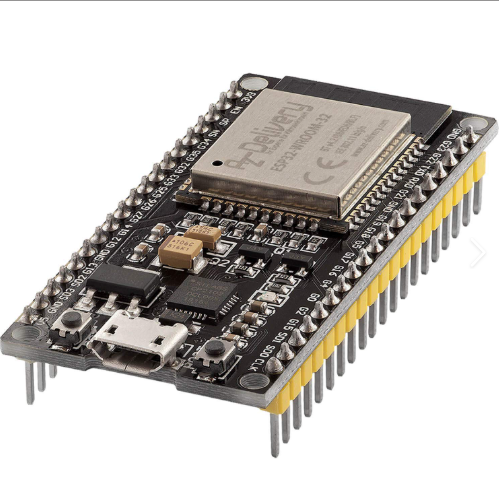
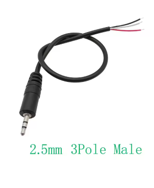
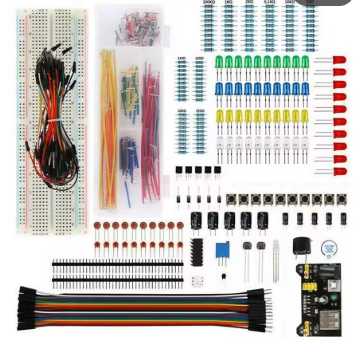
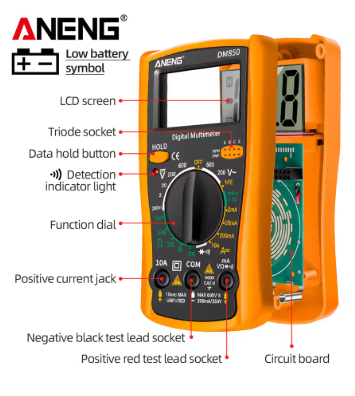

# Project Materials List for Classpad-Gemini-Integration
| Item                                                | Status                                             | Link                                                                                                         | Cost          |
|-----------------------------------------------------|----------------------------------------------------|--------------------------------------------------------------------------------------------------------------|---------------|
| ESP32                               | Receiving from friend                              | n/a                                                                                                          | free!         |
| 2.5mm 3-Pole Male Pigtail Cable  | Ordered from AliExpress  Expected Arrival ~15 days | https://www.aliexpress.com/item/1005005323735681.html?spm=a2g0o.order_list.order_list_main.10.1f7f1802iX4dpf | AU$2.57       |
| Electronics Kit                      | Ordered from AliExpress Expected Arrival ~15 days  | https://www.aliexpress.com/item/1005007196303273.html?spm=a2g0o.order_list.order_list_main.15.1f7f1802iX4dpf | AU$3.67       |
| Multimeter             | Ordered from AliExpress Expected Arival ~15 days   | https://www.aliexpress.com/item/1005005221413391.html?spm=a2g0o.order_list.order_list_main.5.1f7f1802iX4dpf  | Total:AU$8.17 |                                                    |

### Notes on Cable and Connection:
* The ClassPad fx-CP400's 3-pin serial port uses 3.3V logic levels

* The ESP32 also uses 3.3V logic levels

* Thus, a logic level shifter is NOT needed for the serial

* The 3-pin link cable is a crossover cable, because we are using the pigtail, this crossover, TX on one device to RX on the other, will need to be ensured in the wiring to the ESP32

* When we get the pigtail cable and multimeter, we can do a continuity test to map its wires to the Tip, Ring, and Sleeve of the 2.5mm plug. (TX, RX, GND)
